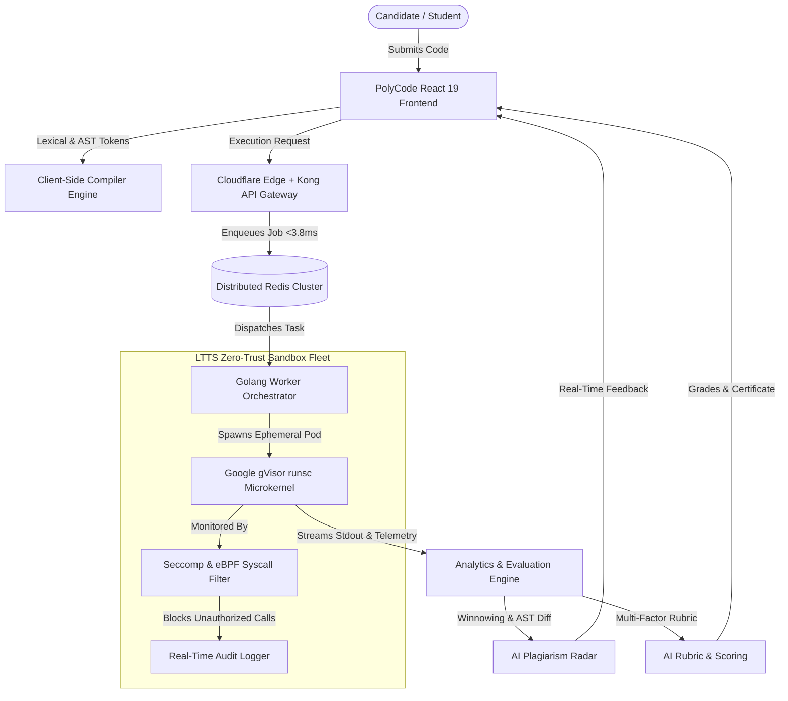

# ⚡ PolyCode: Next-Gen Multi-Language Code Evaluation & Compiler Intelligence Platform

[](https://react.dev/)
[](https://www.typescriptlang.org/)
[](https://vitejs.dev/)
[](https://gvisor.dev/)
[](https://theory.stanford.edu/~aiken/publications/papers/sigmod03.pdf)
[](https://www.ltts.com/)

> **PolyCode** is an enterprise-grade automated code assessment and compiler intelligence platform featuring 8 polyglot runtimes, a real-time 5-stage compiler pipeline visualizer (Lexer to Assembly), a Winnowing-based AI plagiarism radar, and a zero-trust Google gVisor microkernel sandbox with multi-factor rubric grading.

---

## 📑 Table of Contents
- [The Problem vs. The PolyCode Solution](#-the-problem-vs-the-polycode-solution)
- [Key Features](#-key-features)
  - [1. 8 Polyglot Execution Runtimes](#1-8-polyglot-execution-runtimes)
  - [2. 5-Stage Live Compiler Pipeline Visualizer](#2-5-stage-live-compiler-pipeline-visualizer)
  - [3. Multi-Algorithmic AI Plagiarism Radar](#3-multi-algorithmic-ai-plagiarism-radar)
  - [4. Multi-Factor Automated Grading Rubric](#4-multi-factor-automated-grading-rubric)
  - [5. LTTS Zero-Trust Sandbox Fleet & Live Telemetry](#5-ltts-zero-trust-sandbox-fleet--live-telemetry)
  - [6. Formal Certificate Export](#6-formal-certificate-export)
- [System Architecture](#-system-architecture)
- [Technology Stack](#-technology-stack)
- [Getting Started](#-getting-started)
- [Project Directory Structure](#-project-directory-structure)
- [Presentation & Pitch Deck](#-presentation--pitch-deck)

---

## 🚨 The Problem vs. The PolyCode Solution

| Dimension | Traditional Online Judges (LeetCode, HackerRank) | PolyCode Intelligence Platform |
| :--- | :--- | :--- |
| **Evaluation Model** | **Black-Box Testing:** Checks only if `stdin -> stdout` matches. | **White-Box Intelligence:** Inspects token streams, AST nodes, symbol scopes, IR optimizations, and generated assembly. |
| **AI Cheating Defense** | **Primitive String Matchers:** Easily fooled when candidates rename variables or reorder loops. | **Multi-Layer Radar:** Winnowing N-gram rolling hashes + AST isomorphism detect LLM-generated code regardless of variable renaming. |
| **Execution Security** | **Shared Host Containers:** Vulnerable to fork bombs, memory snooping, socket exfiltration, and kernel breakouts. | **Zero-Trust Microkernels:** Google gVisor (`runsc`) user-space microkernels + Linux Seccomp & eBPF syscall filtering. |
| **Grading Philosophy** | **Binary Pass/Fail:** No insight into code maintainability or Big-O bounds. | **Multi-Factor Rubric:** 50% Correctness, 25% Code Quality, 15% Security, 10% Big-O Complexity Bonus. |

---

## 🌟 Key Features

### 1. 8 Polyglot Execution Runtimes
PolyCode natively supports modern compiled and interpreted programming languages with custom execution harnesses:
* 🐍 **Python 3.12** (`python3 -m py_compile`)
* ⚙️ **C++20** (`g++ -O3 -std=c++20`)
* 🦀 **Rust 1.77** (`rustc -O --edition 2021`)
* ☕ **Java 21** (`javac` & OpenJDK 21 JVM)
* 🔷 **TypeScript 5.3** (Strict type-checking + ES2022)
* ⚡ **JavaScript** (Node.js 20 / V8 11.3)
* 💻 **C17** (`clang -O2 -std=c17`)
* 🐹 **Go 1.22** (`go build`)

### 2. 5-Stage Live Compiler Pipeline Visualizer
Demystifies the entire compilation lifecycle in real time:
1. **Lexical Analysis (Scanner):** Regex finite-state machine categorizes `KEYWORD`, `IDENTIFIER`, `TYPE`, `LITERAL_NUMBER`, `LITERAL_STRING`, `OPERATOR`, and `PUNCTUATION` with precise line/column coordinates.
2. **Syntax AST Parsing:** Constructs an interactive, collapsible Abstract Syntax Tree displaying hierarchy, expressions, and lexical scope depths.
3. **Semantic Symbol Table:** Tracks identifier declarations, data types, mutability (`Mutable`, `Immutable`, `Const`), reference counters, and stack frame memory offsets (e.g. `[rbp-8]`).
4. **IR Optimization Passes:** Demonstrates compile-time Constant Folding (`-O2`), Dead Code Elimination (DCE), and generates interactive Control Flow Graphs (CFG).
5. **Multi-Target Code Generation & Disassembly:** Emits clean disassembly with opcode hex bytes, registers, and comments across:
   - **x86-64 Intel Assembly**
   - **ARM64 RISC Assembly**
   - **WebAssembly (WASM S-Expressions)**
   - **Python Bytecode VM Instructions**

### 3. Multi-Algorithmic AI Plagiarism Radar
Combines multiple detection algorithms to stop LLM copy-pasting (ChatGPT, Claude, Copilot):
* **Winnowing Algorithm (Rabin-Karp Hashes):** Generates polynomial rolling hashes across sliding token $k$-grams ($k=4, w=4$). Selects window minimum fingerprints, making it immune to variable renaming or formatting changes.
* **AST Isomorphism:** Analyzes syntax tree invariant topologies to flag identical algorithmic logic even if the code was syntactically restructured.
* **AI Synthesis Probability Estimator:** Measures identifier entropy, canonical docstrings, and signature patterns common to LLMs.
* **Side-by-Side Visual Diff:** Synchronized split-screen comparative view highlighting matching segments against AI canonical solutions.

### 4. Multi-Factor Automated Grading Rubric
Calculates a holistic score and assigns letter grades (`A+` to `F`):
* **50% Functional Correctness:** Execution against public functional test cases and hidden large-scale edge cases (e.g., 10k items, negative boundaries).
* **25% Code Quality & Style:** Clean variable naming, modularity, comments, language idioms, and structural hygiene.
* **15% Security & Memory Safety:** Memory bound compliance with zero illegal syscall attempts.
* **10% Big-O Complexity Bonus:** Automated Big-O Time (e.g., $O(N)$ hash lookup vs $O(N^2)$ brute force) and Space complexity detection.

### 5. LTTS Zero-Trust Sandbox Fleet & Live Telemetry
Production-grade multi-tenant container isolation benchmarked for enterprise hiring:
* **Google gVisor (`runsc`) Microkernel:** Virtualized user-space kernel intercepts guest OS calls; candidates never touch the host kernel.
* **Linux Seccomp & eBPF Syscall Shield:** Real-time blockage of malicious system calls:
  - 🚫 `SYS_ptrace` (Memory snooping & process injection)
  - 🚫 `SYS_socket` (Unauthorized outbound network calls)
  - 🚫 `CLONE_NEWUSER` (Privilege escalation attempts)
* **Live Cluster Dashboard:** Displays Redis job queue depth, throughput (124.5 jobs/s), active worker health, and security audit events.

### 6. Formal Certificate Export
Generates an official, printable candidate assessment certificate with score breakdowns, candidate performance badges, and LTTS enterprise security seals.

---

## 🏗️ System Architecture



---

## 💻 Technology Stack

* **Frontend:** React 19, TypeScript 5.3, Vite 6, Lucide Icons, Canvas Confetti
* **Styling:** Custom bespoke Dark Glassmorphism CSS design system (zero external CSS framework bloat)
* **Compiler Services:** Custom TypeScript Lexical Scanner, Recursive Descent AST Parser, SSA Constant Folding Optimizer, Disassembler
* **Anti-Cheat Engine:** Rabin-Karp polynomial rolling hash, Winnowing fingerprint selector, AST tree isomorphism matcher
* **Cloud & Security:** Google gVisor microkernels (`runsc`), Linux Seccomp, Redis distributed queues, eBPF telemetry hooks

---

## 🚀 Getting Started

### Prerequisites
* **Node.js:** v18.0.0 or higher
* **npm:** v9.0.0 or higher

### Installation & Local Run
```bash
# 1. Clone or open the repository
cd c:/Hackathon

# 2. Install dependencies
npm install

# 3. Start the Vite development server
npm run dev
```
Open [http://localhost:5173](http://localhost:5173) in your browser to launch PolyCode.

### Production Build
```bash
npm run build
npm run preview
```

---

## 📂 Project Directory Structure

```
c:/Hackathon/
├── PolyCode_Hackathon_Presentation.html  # Interactive 5-slide presentation web deck
├── PolyCode_Hackathon_Presentation.pptx  # 16:9 PowerPoint presentation file
├── generate_ppt.py                       # Python script for generating the PPTX
├── index.html                            # Main HTML entry point
├── package.json                          # Dependencies & scripts
├── tsconfig.json                         # TypeScript configuration
├── vite.config.ts                        # Vite configuration
└── src/
    ├── App.tsx                           # Main application orchestrator & tab controller
    ├── main.tsx                          # React 19 root mounting
    ├── components/
    │   ├── Navbar.tsx                    # Top navigation & language / challenge selectors
    │   ├── editor/
    │   │   ├── CodeEditor.tsx            # Multi-language code editor with stdin/stdout
    │   │   └── ExecutionConsole.tsx      # Terminal output & telemetry monitor
    │   ├── compiler-pipeline/
    │   │   ├── CompilerPipelineView.tsx  # 5-stage pipeline stepper
    │   │   ├── LexicalAnalysisView.tsx   # Stage 1: Token stream & regex rules
    │   │   ├── SyntaxAstView.tsx         # Stage 2: Interactive AST visualizer
    │   │   ├── SemanticSymbolTableView.tsx # Stage 3: Scope & symbol table
    │   │   ├── OptimizationIrView.tsx    # Stage 4: Constant folding & CFG graph
    │   │   └── CodeGenerationView.tsx    # Stage 5: x86/ARM/WASM disassembly
    │   ├── plagiarism/
    │   │   └── PlagiarismRadarView.tsx   # Winnowing radar & synchronized diff view
    │   ├── evaluation/
    │   │   └── EvaluationView.tsx        # Multi-dimensional rubric & grade cards
    │   ├── ltts-infra/
    │   │   └── LttsInfraView.tsx         # gVisor fleet telemetry & syscall audit log
    │   ├── challenges/
    │   │   └── ChallengeModal.tsx        # Coding challenge selector
    │   └── export/
    │       └── ReportModal.tsx           # Printable official assessment certificate
    ├── data/
    │   ├── challenges.ts                 # Algorithmic challenges & test cases
    │   ├── languages.ts                  # 8 language configurations & starter code
    │   └── lttsInfra.ts                  # Cluster nodes & security telemetry mock data
    ├── services/
    │   ├── compiler/                     # Lexer, parser, optimizer, codegen, runner
    │   ├── similarity/                   # Winnowing hashing & AI reference generator
    │   └── evaluation/                   # Rubric grading & Big-O estimation
    ├── styles/                           # Dark glassmorphism global CSS system
    └── types/
        └── index.ts                      # Core TypeScript interfaces & definitions
```

---

## 📽️ Presentation & Pitch Deck

For presenting at hackathons or team demos, two ready-to-use slide decks are included:

1. **PowerPoint Presentation (`.pptx`):**
   * [`PolyCode_Hackathon_Presentation.pptx`](file:///c:/Hackathon/PolyCode_Hackathon_Presentation.pptx) — 5 widescreen slides with complete speaker notes embedded in PowerPoint.
2. **Interactive Browser Slide Deck (`.html`):**
   * [`PolyCode_Hackathon_Presentation.html`](file:///c:/Hackathon/PolyCode_Hackathon_Presentation.html) — Press **`F`** for fullscreen, **`Right Arrow / Space`** to advance, and **`N`** for pitch notes.

---

## 👥 Authors & Acknowledgements
* **PolyCode Engineering Team** — Built for the Hackathon Grand Finale.
* **Architecture Alignment:** Benchmarked against **L&T Technology Services (LTTS)** enterprise standards for multi-tenant cloud sandboxing and automated developer assessment.

---
*PolyCode — The Future of Developer Assessment & Compiler Intelligence.*
